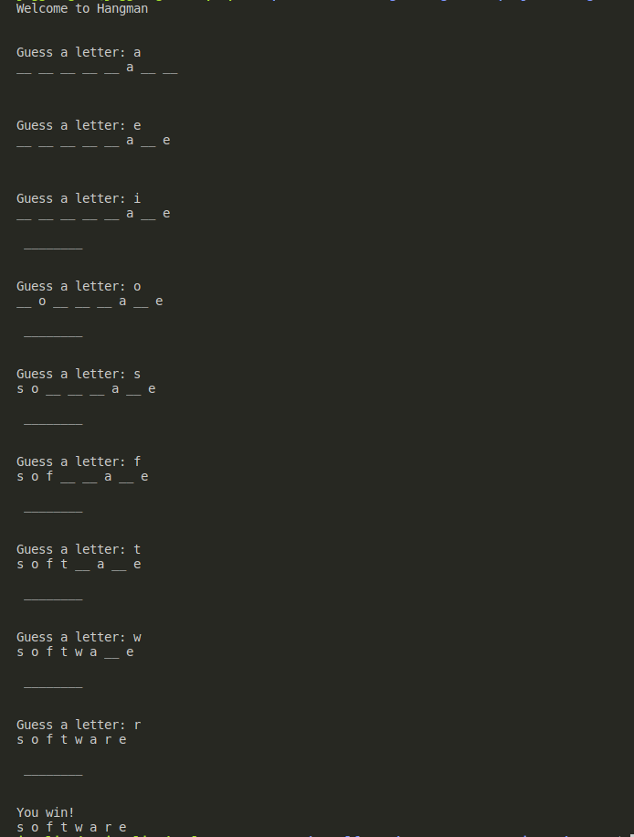
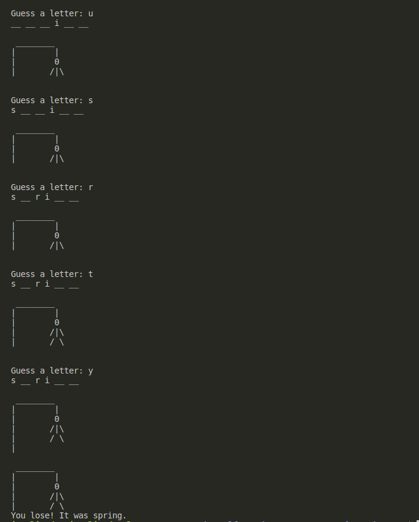

# Title

This is a solution to Hangman from The Self-Taught Programmer by Cory Althoff.

## Table of contents

- [Title](#title)
  - [Table of contents](#table-of-contents)
  - [Overview](#overview)
    - [Screenshots](#screenshots)
    - [Link](#link)
    - [Game Rules](#game-rules)
  - [My process](#my-process)
    - [Built with](#built-with)
    - [What I learned](#what-i-learned)
    - [Continued development](#continued-development)
    - [Useful resources](#useful-resources)
  - [Author](#author)
  - [Acknowledgments](#acknowledgments)

## Overview

### Screenshots

Sample Winning Game:

Sample Losing Game:

### Link

- Solution URL: [Hangman](https://github.com/jugglingdev/hangman)

### Game Rules

Based off of the popular Hangman game, the rules as dictated by Cory Althoff are:

  1. The computer selects a secret word and draws a line for each letter.
  2. The user tries to guess the word one letter at a time.
  3. If the user guesses a letter correctly, the computer replaces the corresponding line with the correct letter.  If a letter appears twice in a word, the user has to guess it twice.
     OR
     If the user guesses incorrectly, the computer draws a body part of a hanged stick figure starting with the head.
  4. If the user completes the word before the drawing of the hangman is complete, they win.  If not, they lose.

## My process

### Built with

- Python 3.10.6

### What I learned

This was my first project in Python (yay...).  While I was familiar with writing games from the console, this was my first one doing so in this language.

I see why so many people like Python.  It feels incredibly easy, especially coming off of some Java study.  The syntax is very friendly to work with.

Through this project, I got experience coding if-statements, while loops, functions, and methods all in Python.

I did refactor some of the code so that the variable names are more clear.  I also tweaked spacing and indentation here and there for legibility.

### Continued development

In future Python projects, I'm looking forward to applying OOP principles to the code.

### Useful resources

- [Hangman Solution](https://github.com/calthoff/tstp/tree/master/part_I/bringing_it_all_together) - Cory's solution.  Note: His variable names are updated from the book version I used.  I was pleasantly surprised that I matched most of his!

## Author

- Kayla Paden - Find me at [GitHub](https://github.com/jugglingdev), [freeCodeCamp](https://www.freecodecamp.org/jugglingdev), [Frontend Mentor](https://www.frontendmentor.io/profile/jugglingdev), [LinkedIn](https://www.linkedin.com/in/kayla-marie-paden)

## Acknowledgments

Shoutout to Cory Althoff for his clear and concise manner of teaching coding the self-taught way.  Thanks, Cory!
